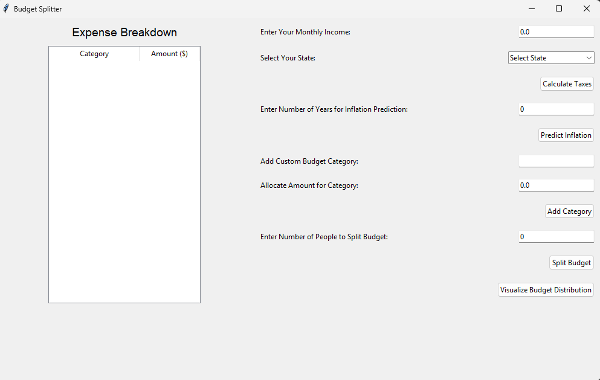
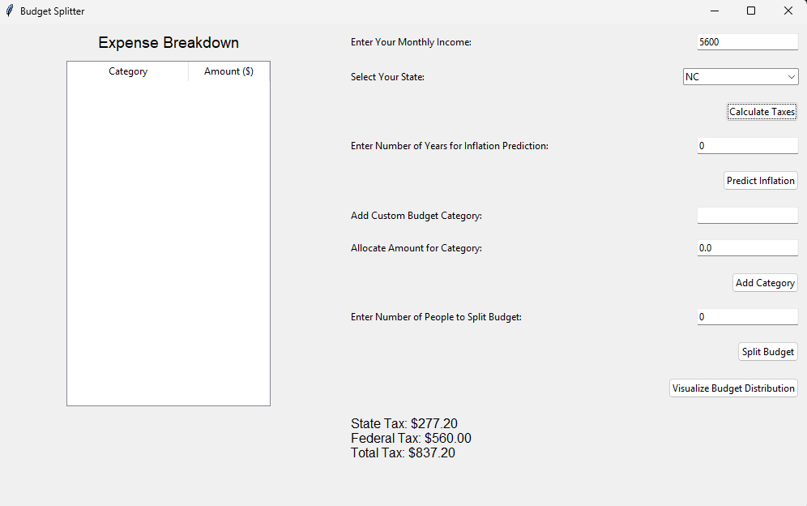
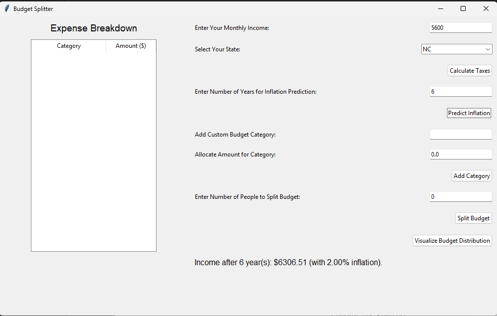
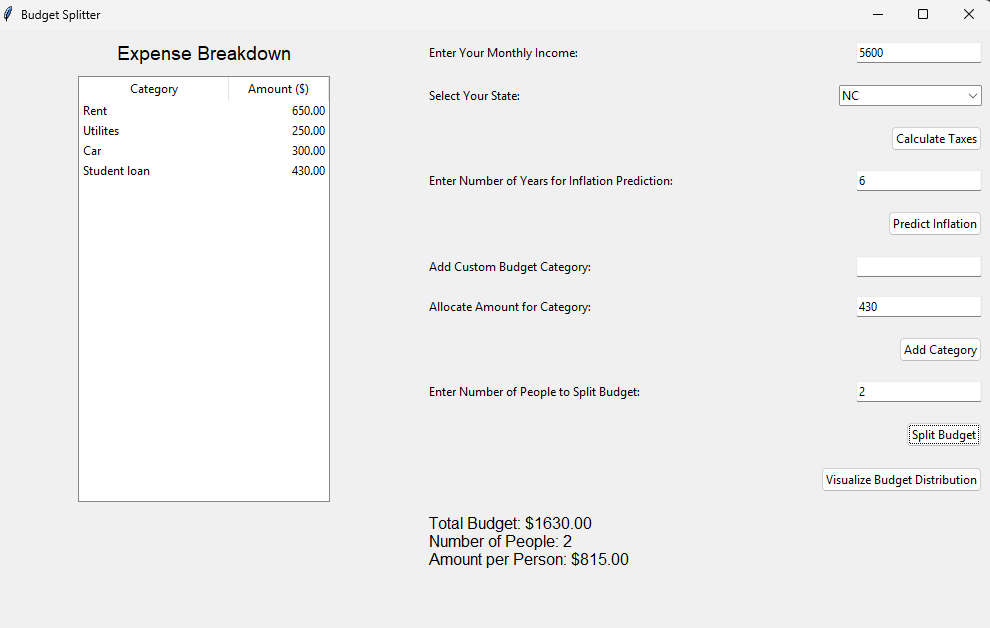

# Budget Splitter
Budget Splitter is a user-friendly application designed to help individuals and groups manage their budgets effectively. It includes tax calculation, inflation predictions, customizable budget categories, and expense splitting.
## Features
- Monthly Income Management: Input your monthly income and plan expenses accordingly.
- Tax Calculation: Calculate state and federal taxes based on your location.
- Inflation Prediction: Predict future budget requirements with inflation adjustments.
- Custom Budget Categories**: Add and allocate amounts for custom budget categories.
- Expense Splitting: Split monthly budgets among multiple people for shared expenses like rent or bills.
- Visualization: View budget allocation with dynamic pie charts.
- State-Specific Tax Rates: Accurate tax rates for all U.S. states and territories.
## Requirements
To run this project, you need the following:
- Python 3.7 or higher
- Required Python Libraries:
  - `tkinter` (built-in with Python)
  - `requests` (`pip install requests)
  - `matplotlib` (`pip install matplotlib`)
## Installation
1. Clone the repository or download the project files:
   ```bash
   git clone https://github.com/your-username/budget-splitter.git
2. Navigate to the project directory
   ```bash
   cd budget-splitter
3. Install the required libraries
   ```bash
   pip install requests
   pip install matplotlib
4. Run the application
## Usage
1. Enter your monthly income and select your state/territory
2. Calculate state and federal taxes using the "Calculate Taxes" button.
3. Predict future income adjustments with the inflation prediction section.
4. Add custom budget categories and allocate amounts for each.
5. Split your budget among multiple people and view individual contributions.
6. Visualize your budget distribution with the pie chart feature.
## Screenshots





##Future Enhancements
1. Integration with more tax and inflation APIs for global support.
2. Export budget breakdowns to Excel or PDF.
3. Integration with bank APIs for automatic expense tracking.
4. Enhanced UI/UX for a more interactive experience.
## License
This project is licensed under the MIT License. For details, please see the [LICENSE](LICENSE) file.
## Contributing
We welcome contributions from the community. Please see our [CONTRIBUTING.md](CONTRIBUTING.md) file for detailed guidelines.
When submitting a pull request, follow the steps outlined in our [Pull Request Template](.github/PULL_REQUEST_TEMPLATE.md).
## Code of Conduct
This project adheres to a [Code of Conduct](CODE_OF_CONDUCT.md). By participating, you are expected to uphold this code.
## Changelog
All notable changes to this project are documented in the [Changelog](CHANGELOG.md).
## Acknowledgments
1. Open Exchange Rates provides to provide real-time currency exchange rates.
2. Python Community: For maintaining libraries like tkinter and requests.
